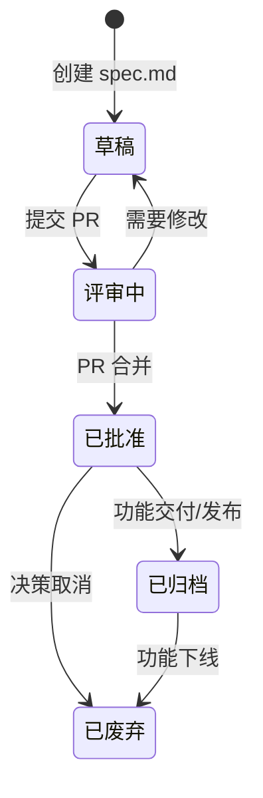

# CodeCraft Spec 工作流 v2

本规约定义了 `CodeCraftAI` 项目的**分级工作流**。所有变更都必须根据其性质，选择合适的流程级别。

## 流程分级 (Tiered Process)

为了平衡**严谨性**与**敏捷性**，我们定义了两种流程级别：

-   **Tier-1 (Full):** **默认流程**，适用于所有**新功能**、**重大架构变更**或**任何对现有接口产生破坏性修改**的变更。此流程强制执行所有的文档、审批和审查环节。
-   **Tier-2 (Lite):** **简化流程**，适用于**小型的 bug 修复**、**非功能性的代码重构**或**不影响任何现有接口**的内部实现优化。

**在创建任何变更时，必须在 `spec.md` 的 `<元数据>` 中明确声明其流程级别，例如 `<流程级别>Tier-1</流程级别>`。**

---

## Tier-1 (Full) 工作流

这是最严谨的流程，包含所有的人机交互和文档节点。

1.  **Phase 1: 提案**
    -   *输入*: 用户需求。
    -   *活动*: AI 代理分析索引，创建 `spec.md` 草案。
    -   *输出*: 一个包含完整 `<核心请求>` 分析的 `spec.md` 文件，但 `<阶段化开发>` 部分为空。

2.  **Phase 2: 阶段划分与审批**
    -   *输入*: `spec.md` 草案。
    -   *活动 (AI)*: AI 代理分析 `<核心请求>`，并在 `<阶段化开发>` 块中，提出关于“核心功能”和“次要功能”的划分**建议**。
    -   **--- 人机协作暂停点 ---**
    -   *活动 (人类)*: **人类开发者审查、修改并最终批准 AI 提出的阶段划分方案。**
    -   *输出*: 一个阶段划分方案已获批准的、完整的 `spec.md`。

3.  **Phase 3: 实施**
    -   *输入*: 已批准的 `spec.md`。
    -   *活动*: AI 代理根据 `<核心功能>` 列表，进行 TDD 开发。**AI 被严格禁止在所有核心功能完成前，触碰任何次要功能。**
5.  **Phase 4: 验证与文档同步** (测试 -> 全面更新所有受影响的文档)
6.  **Phase 5: 归档与索引** (归档 -> 更新 `INDEX.md`)

---

## Tier-2 (Lite) 工作流

这是为提升敏捷性而设计的简化流程。

1.  **Phase 1: 提案** (分析索引 -> 创建 `spec.md` 草案)
    - 在此级别，`spec.md` 可以更简洁，重点在于清晰地描述问题和解决方案。

2.  **Phase 2: 审查与实施**
    - AI 在完成 `spec.md` 后，可**直接生成 `tasks.md`**（无需创建 `DEV_SPEC.md`）。
    - **无需等待人类审批**，AI 在向用户报告其计划后，可立即开始实施。**人类用户保留随时叫停的权力。**

3.  **Phase 3: 验证与归档**
    - 运行所有测试。
    - **文档同步仍是强制的**，但范围通常更小。
    - 归档并（如果需要）更新索引。

通过这套分级系统，我们确保了在需要严谨的地方绝不妥协，在可以加速的地方绝不拖延。

---

## 附录 A: 手动预提交清单 (v0.1 - 待自动化)

> **重要提示**: 以下清单是在我们的自动化工具链（`spec-linter` 和 `indexer-tool`）完全投入使用前的**临时保障措施**。所有开发者在提交新的规约或变更时，**必须**手动完成以下所有检查。

在您的 `spec.md` 文件准备好提交并合并之前，请逐项确认：

-   [ ] **1. UID 唯一性检查**:
    -   [ ] **检查索引**: 在全局的 `.codecraft/spec/INDEX.md` 文件中，搜索您将要使用的新 UID (例如, `spec-004`, `feat-xyz-001`)，确认它**不存在**。
    -   [ ] **检查归档**: 在 `.codecraft/spec/archive/` 目录中进行全局搜索，再次确认该 UID 从未被历史规约使用过。

-   [ ] **2. 索引手动更新**:
    -   [ ] **添加条目**: 打开 `.codecraft/spec/INDEX.md` 文件。
    -   [ ] **遵循格式**: 模仿现有条目的格式，在正确的分类下，添加指向您新规约文件的链接和简短描述。

-   [ ] **3. 语法目视检查**:
    -   [ ] **标签配对**: 打开您的 `.md` 规约文件，快速目视检查所有自定义 XML 风格的标签（如 `<规约>`, `<元数据>`, `<核心请求>` 等）是否都已正确闭合（例如，有对应的 `</规约>`）。
    -   [ ] **无嵌套错误**: 确保标签没有发生错误的交叉嵌套（例如 `<A><B></A></B>`）。

-   [ ] **4. 状态声明**:
    -   [ ] **更新元数据**: 确认规约文件中的 `<状态>` 标签已从 `草稿` 更新为 `已批准` 或其他适当的状态。

**完成此清单是确保我们知识库完整性和一致性的关键一步。**

---

## 附录 B: 协作与版本控制 (v1.0)

> **核心原则**: 规约的“语义完整性”高于一切。Git 的自动合并工具无法理解我们自定义语法的上下文，因此，**绝不能盲目接受自动合并的结果**。

### 1. 预防冲突的最佳实践

-   **提前沟通**: 在对一个被多人关注的核心规约（如 `PRINCIPLES.md`）进行重大修改前，应在团队频道中提前声明意图。
-   **小步提交**: 尽量将大的变更分解为小的、逻辑独立的提交。这会让代码审查（Code Review）和冲突解决都变得更加容易。
-   **使用草稿 PR**: 对于复杂的变更，可以先创建一个“草稿拉取请求 (Draft Pull Request)”，这是一种有效的“锁定”机制，可以告知其他开发者该文件正在被密集修改。

### 2. 解决冲突的指导方针

当 `spec.md` 文件出现合并冲突（merge conflict）时，请遵循以下步骤：

1.  **拒绝自动合并**: **不要**使用 `git mergetool` 或编辑器提供的“一键合并”功能来处理规约文件的冲突。
2.  **仔细审查双方变更**: 在 Git 标记的冲突区域 (`<<<<<<<`, `=======`, `>>>>>>>`)，仔细阅读你本地的 (`HEAD`) 和远程的 (`incoming`) 两份变更。
3.  **手动整合**:
    -   以其中一个版本（通常是远程的最新版本）为基础。
    -   将另一个版本中的逻辑变更，**手动地、有意义地**整合进来。
    -   **关键是整合思想，而非整合文本**。例如，如果双方都修改了 `<实施计划>`，你应该理解双方的意图，然后撰写一个全新的、包含了两种想法的 `<实施计划>`，而不是简单地将两段文本拼接在一起。
4.  **最终验证**: 在解决冲突后，重新通读整个规约文件，确保其逻辑通顺，且所有自定义 XML 语法都保持完整和正确。

---

## 附录 C: 规约生命周期 (v1.0)

> 为了确保所有规约的状态清晰可追溯，我们定义了以下标准生命周期。每个规约的当前状态都必须在其 `<元数据>` 块的 `<状态>` 标签中明确声明。

### 状态流转图

### 状态定义

-   **`草稿 (Draft)`**
    -   **定义**: 规约的初始状态。它存在于一个特性分支上，正在被积极地撰写和修改。
    -   **触发条件**: 通过在 `changes/` 目录下创建一个新的 `spec.md` 文件来进入此状态。

-   **`评审中 (In Review)`**
    -   **定义**: 规约已准备好接受团队的正式审查。
    -   **触发条件**: 为包含该规约的特性分支创建了一个拉取请求 (Pull Request)。

-   **`已批准 (Approved)`**
    -   **定义**: 规约已经通过了所有审查，并被合并到主干分支。它现在是“当前的真相来源 (source of truth)”，开发工作应以此为准。
    -   **触发条件**: 相关的拉取请求被合并。

-   **`已归档 (Archived)`**
    -   **定义**: 与规约相关的功能或变更已经成功交付、部署并发布。规约的历史价值被保留，但它不再是“活跃”的开发指导。
    -   **触发条件**: 相关代码上线，项目经理或团队负责人确认后，将规约文件从 `changes/` 移动到 `archive/`。

-   **`已废弃 (Deprecated)`**
    -   **定义**: 该规约所描述的功能或想法，因业务决策、技术路径变更或其他原因而被主动放弃。它存在的意义是记录“我们曾考虑过但最终没有做的事情”。
    -   **触发条件**: 团队做出明确的“不下线”或“不实施”决策。如果规约还在 `changes/` 目录下，可直接删除；如果已在 `archive/`，则将其状态更新为 `已废弃`。
